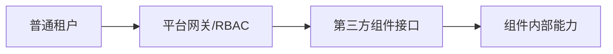

# AI/ML Interface Map Workflow

Use this reference to map third-party component interfaces in AI/ML platforms. Keep the output as an
interface map: inventory, exposure, protection assumptions, tenant visibility, and danger labels.

## Core Principle

Many AI/ML components were originally built for trusted operators, internal clusters, or single-user
developer environments. When integrated into a multi-tenant GPU or AI platform, the key question is
which interfaces are now reachable through the platform and which protection boundary they assume.

Do not start from vulnerability categories. Start from interfaces and map their expected consumers.
Do not write a vulnerability report unless the user explicitly asks for one.

## Evidence Sources

Prefer these sources:

- Repository route definitions, API handlers, OpenAPI files, gRPC protobufs, frontend route maps,
  WebSocket/SSE handlers, CLI server entrypoints.
- Kubernetes Service, Ingress, Gateway API, Istio/Envoy, Nginx, Helm values, Docker Compose, systemd,
  port mappings, and network policy files.
- Component configuration files, default configuration, authentication middleware, proxy adapters,
  service-account bindings, object-store credentials, and environment variables.
- Safe read-only behavior from GET, HEAD, OPTIONS, service discovery, and documentation endpoints.

Avoid active mutation. If an interface can execute code, submit jobs, change model state, or write
artifacts, mark it and do not call the dangerous operation.

## Interface Families

Classify each interface into one primary family:

| Family | Examples | Common danger |
| --- | --- | --- |
| API | REST/OpenAPI routes, component SDK APIs | state change, sensitive reads, weak tenant scoping |
| Dashboard | UI routes, admin consoles, iframe/proxy dashboards | operator-only functions exposed to tenants |
| Runtime | notebooks, kernels, terminals, Ray jobs, Dask tasks | code execution and workload control |
| Model Serving | inference, model load/unload, repository control | model state change, data leakage, backend abuse |
| Artifact | model registry, experiment artifacts, datasets, checkpoints | cross-tenant artifact read/write |
| Storage | S3-compatible APIs, buckets, volumes, mounted paths | broad object access through service identity |
| Telemetry | metrics, logs, traces, GPU/node/job views | cross-tenant operational data exposure |
| Streaming | WebSocket, SSE, log tails, event streams | long-lived auth bypass or cross-tenant streams |
| Management | admin APIs, health/debug, config, cluster control | platform control-plane exposure |
| Auth/Admin | users, tokens, roles, OAuth/OIDC callbacks | identity or role boundary confusion |
| Proxy | notebook proxy, dashboard proxy, route rewrite, backend URL proxy | caller-controlled backend or auth stripping |

## Interface Inventory Schema

Keep a structured inventory while reading evidence:

```yaml
interface_id: IFACE-AIML-MAP-001
component: <MLflow | Ray | Jupyter | Dask | Open WebUI | Kubeflow | Triton | Prometheus/DCGM | MinIO | other>
component_version: <version | unknown>
interface: <human-readable interface name>
interface_family: <API | Dashboard | Runtime | Model Serving | Artifact | Storage | Telemetry | Streaming | Management | Auth/Admin | Proxy>
path_or_rpc: <HTTP path, gRPC RPC, service route, or unknown>
port: <port number | service port | unknown>
protocol: <HTTP | REST | gRPC | WebSocket | SSE | S3 | TCP | unknown>
methods_or_operations:
  - <GET | POST | submit | cancel | load | unload | read | write | proxy | unknown>
capability: <what the interface lets the caller do>
category: <Inference API | Model Repository | Model Control | Telemetry | Management | Runtime | Storage | Proxy | Auth/Admin | other>
default_exposure: <public-by-default | enabled-by-default | optional | internal-by-default | localhost-only | disabled-by-default | unknown>
built_in_authn: <present | absent | optional | unknown>
built_in_authz_scope: <user | workspace | project | namespace | tenant | object | admin | service | absent | unknown>
authn_authz_by_component: <none | authn-only | coarse-authz | object-authz | tenant-authz | externalized | unknown>
default_protection_assumption: <self-protected | external-platform-protected | trusted-internal-only | localhost-only | unknown>
observed_platform_protection: <gateway | oidc | token | basic-auth | network-policy | service-mesh | ingress-only | none | unknown>
observed_exposure: <public | tenant-facing | workspace-facing | cluster-internal | admin-only | localhost | unknown>
ordinary_tenant_decision: <safe_to_expose_to_tenant | tenant_exposure_requires_platform_authz | admin_or_platform_only | internal_only | destructive_do_not_call | unknown_needs_evidence>
danger_if_exposed_to_tenants: <short tenant-facing risk statement>
danger_labels:
  - <execution | state-changing | sensitive-read | admin | artifact-write | artifact-read | model-control | proxying | telemetry-cross-tenant | credential-adjacent | none | unknown>
related_config_or_flag:
  - <config file, CLI flag, Helm value, env var, or unknown>
source_location:
  - <source file, handler, docs URL, config path, or unknown>
evidence:
  - <file path, route, config, documentation, read-only probe result>
evidence_gaps:
  - <missing evidence>
notes: <short rationale>
```

When producing a component-specific interface map, render the table with these columns:

| Interface | Protocol | Path / RPC | Port | Capability | Category | Default Exposure | AuthN/AuthZ by Component | Danger if exposed to tenants | Related config / flag | Source location |
| --- | --- | --- | --- | --- | --- | --- | --- | --- | --- | --- |

Use the component name in the auth column heading when useful. For Triton, use
`AuthN/AuthZ by Triton`.

## Classification Rules

Mark an interface `destructive_do_not_call` when it can submit workloads, execute code, create or
delete resources, mutate artifacts, upload files, restart services, load/unload models, change
permissions, or trigger external callbacks.

Mark an interface `admin_or_platform_only` when it exposes component administration, platform
operation, debug information, cluster/node visibility, service credentials, global config, user/role
management, model repository control, or broad log visibility.

Mark an interface `internal_only` when the component documentation or deployment pattern assumes a
trusted cluster, localhost, private service network, or service-to-service caller, and no tenant-level
authorization is visible.

Mark an interface `tenant_exposure_requires_platform_authz` when tenants may legitimately use the
interface, but the component itself does not enforce tenant, workspace, namespace, object, or project
authorization with enough evidence.

Mark an interface `safe_to_expose_to_tenant` only when the operation is non-destructive, has clear
tenant/workspace/object scoping, and has concrete evidence of authentication and authorization.

Use `unknown_needs_evidence` when evidence is incomplete. Do not guess.

## Dangerous Interface Heuristics

Treat these as high-signal danger labels:

- Runtime execution: notebook kernels, terminals, Ray job submission, Dask task submission, pipeline
  run creation, shell commands, plugin execution, tool/function invocation.
- Management control: admin APIs, cluster/job cancel, worker/node control, debug endpoints, config
  mutation, user/role/token management.
- Model control: model load/unload, model repository mutation, deployment creation, serving backend
  selection, arbitrary model URI or artifact URI.
- Artifact control: model registry writes, checkpoint uploads, dataset reads, experiment artifact
  browsing, object-store access through a shared service account.
- Proxying: route rewrite, backend URL selection, notebook/dashboard proxy, WebSocket upgrade path,
  user-controlled host/path/header forwarding.
- Telemetry visibility: logs, traces, metrics, GPU/node/job status, queue views, pod names, internal
  IPs, environment-derived labels, request bodies, prompts, tokens.

## Triton Interface Mapping Notes

When the target includes NVIDIA Triton Inference Server, write
`{report_dir}/phase1-interface-map/triton_interface_map.md` as the component-specific interface
enumeration file.

Seed the Triton map with known interface families, then verify every row against source, deployment
configuration, or official docs before treating it as target evidence:

| Interface | Category | Risk point |
| --- | --- | --- |
| `/v2/models/{model}/infer` | Inference API | Normal inference entrypoint; tenant exposure depends on model-level authorization and request isolation. |
| `/v2/repository/index` | Model Repository | May enumerate model repository contents and model names. |
| `/v2/repository/models/{model}/load` | Model Control | May trigger model loading and affect backend resource use. |
| `/v2/repository/models/{model}/unload` | Model Control | May affect model availability for other callers. |
| `/metrics` | Telemetry | May expose model names, request counts, latency, GPU utilization, and operational metadata. |
| `gRPC 8001` | Inference / Management | May expose inference and management RPCs depending on enabled service and routing. |

For Triton, pay special attention to:

- HTTP endpoint, gRPC endpoint, and metrics endpoint ports.
- Whether repository, model control, shared memory, trace, statistics, and metrics APIs are enabled.
- Whether the deployment relies on an API gateway, service mesh, Kubernetes NetworkPolicy, or
  platform RBAC because Triton itself may not provide tenant-aware authorization for every exposed
  operation.
- Whether ordinary tenants can reach model repository or model lifecycle controls.
- Whether metrics reveal cross-tenant model names, request volume, GPU behavior, or backend status.

## Phase 1 Output Format

Phase 1 writes three files under `{report_dir}/phase1-interface-map/`.

### 1. `{component_slug}_interface_map.md`

For Triton, write `triton_interface_map.md`.

This file is the component-specific interface enumeration table. Use this structure:

```markdown
# Triton 接口地图

## 1. 范围与证据
| 项 | 内容 |
| --- | --- |

## 2. 接口枚举表
| Interface | Protocol | Path / RPC | Port | Capability | Category | Default Exposure | AuthN/AuthZ by Triton | Danger if exposed to tenants | Related config / flag | Source location |
| --- | --- | --- | --- | --- | --- | --- | --- | --- | --- | --- |

## 3. 高风险接口摘要
| Interface | Category | 风险点 | 普通租户暴露结论 | 证据 |
| --- | --- | --- | --- | --- |

## 4. 证据缺口
| 缺口 | 影响 | 建议只读检查 |
| --- | --- | --- |
```

### 2. `external_protection_dependency_map.md`

This file answers which interfaces rely on external platform protection.

```markdown
# 外部平台保护依赖地图

## 1. 依赖外部保护的接口
| Interface | Component | Default protection assumption | Built-in AuthN/AuthZ | Required platform control | Current evidence | Gap |
| --- | --- | --- | --- | --- | --- | --- |

## 2. 保护边界关系图


## 3. 需要确认的保护点
| Interface | Question | Read-only evidence to collect | Forbidden action |
| --- | --- | --- | --- |
```

### 3. `tenant_exposure_decision_map.md`

This file answers which interfaces should not be directly exposed to ordinary tenants.

```markdown
# 普通租户接口暴露决策地图

## 1. 暴露决策总表
| Interface | Component | Category | Decision | Why | Required conditions | Forbidden operations | Evidence |
| --- | --- | --- | --- | --- | --- | --- | --- |

## 2. 不应直接暴露给普通租户的接口
| Interface | Reason | Safe exposure pattern | Evidence gap |
| --- | --- | --- | --- |

## 3. 只读后续检查
| Check | Purpose | Forbidden action |
| --- | --- | --- |
```

Keep Mermaid diagrams small enough to read. Use multiple diagrams if a single diagram becomes
crowded.

## Final Response

When reporting back to the user, summarize:

- Phase 1 files produced, especially `{component_slug}_interface_map.md`.
- Number of components and interfaces mapped, if known.
- Interfaces that are `admin_or_platform_only`, `internal_only`, or `destructive_do_not_call`.
- Evidence gaps that block confident exposure decisions.

Do not call the output a vulnerability report.
